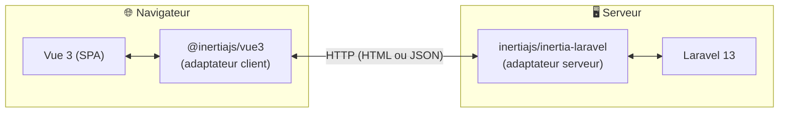
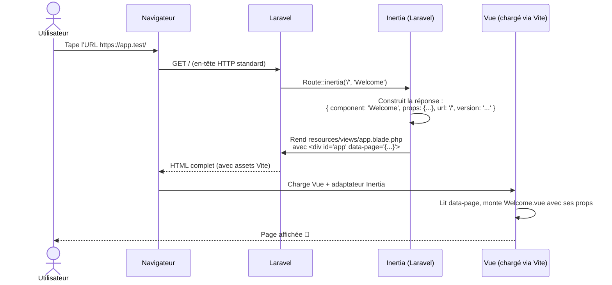
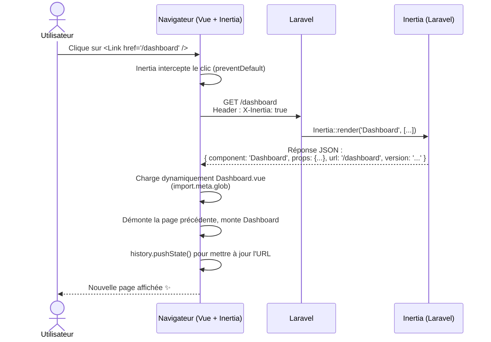
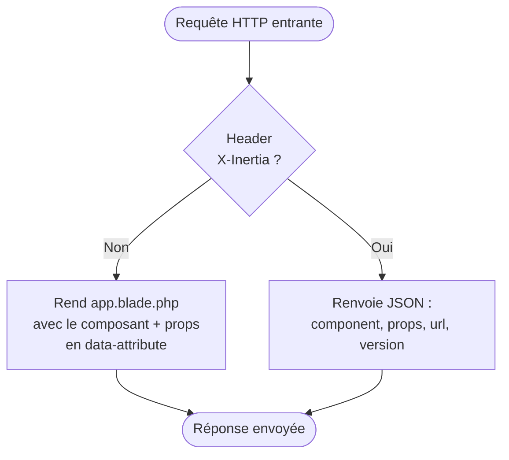
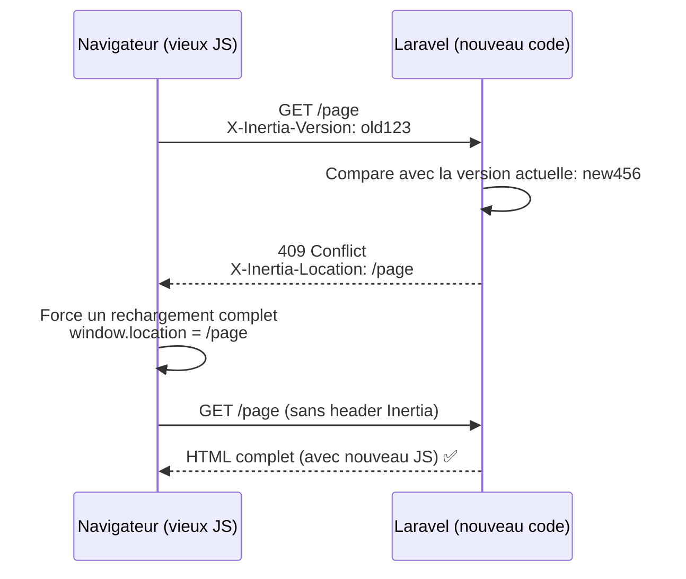

# 2. Architecture et cycle d'une requête

Ce chapitre est le plus important pour **vraiment comprendre** Inertia. Si vous comprenez les deux diagrammes qui suivent, vous comprenez Inertia.

## 2.1 Vue d'ensemble



Les deux **adaptateurs** sont la clé d'Inertia :

- `inertiajs/inertia-laravel` (PHP) : transforme une réponse Laravel en réponse Inertia (HTML au premier visit, JSON ensuite).
- `@inertiajs/vue3` (JavaScript) : intercepte les clics sur les liens, fait des requêtes XHR, et remplace dynamiquement le composant Vue affiché.

## 2.2 Premier chargement (visite initiale)

Quand l'utilisateur visite votre site **pour la première fois** (ou après un rechargement complet), il reçoit du **HTML complet**.



Le serveur renvoie une page HTML normale dans laquelle est embarqué un blob JSON contenant :
- Le **nom du composant** Vue à afficher (`Welcome`)
- Les **props** à lui passer
- L'**URL** actuelle
- Une **version** des assets (pour détecter les déploiements)

## 2.3 Navigation suivante (visite Inertia)

À partir du moment où la page est chargée, **toute navigation** suivante passe par l'adaptateur Inertia côté client. Le serveur ne renvoie plus du HTML mais du **JSON**.



Le point clé : **aucun rechargement de page**. Vue échange juste le composant affiché, comme une SPA classique.

## 2.4 Comment Inertia sait que c'est une requête Inertia ?

L'adaptateur client envoie systématiquement l'en-tête HTTP suivant :

```http
X-Inertia: true
X-Inertia-Version: <hash>
Accept: text/html, application/xhtml+xml
```

Côté Laravel, le middleware `HandleInertiaRequests` détecte cet en-tête et adapte la réponse :

- **Sans `X-Inertia`** → Laravel renvoie le HTML complet (Blade `app.blade.php`).
- **Avec `X-Inertia`** → Laravel renvoie le JSON Inertia.



## 2.5 Anatomie de la réponse Inertia

Que ce soit en HTML ou en JSON, la **payload Inertia** a toujours la même forme :

```json
{
  "component": "Users/Show",
  "props": {
    "user": { "id": 1, "name": "Alice" },
    "errors": {},
    "flash": { "success": null, "error": null }
  },
  "url": "/users/1",
  "version": "a1b2c3d4"
}
```

| Champ | Rôle |
|---|---|
| `component` | Nom du fichier Vue (sans `.vue`) dans `resources/js/pages/` |
| `props` | Données passées au composant Vue |
| `url` | URL à afficher dans la barre d'adresse |
| `version` | Hash des assets — sert à forcer un rechargement complet si le front a été redéployé |

## 2.6 Gestion de la version des assets

Si vous redéployez votre application pendant qu'un utilisateur a une session ouverte, son JavaScript est peut-être **obsolète**. Inertia détecte ça :



C'est entièrement automatique. Vous n'avez rien à faire.

## 2.7 Récapitulatif

| Type de visite | Réponse serveur | Que fait le client ? |
|---|---|---|
| Première visite (URL tapée, F5) | HTML complet | Boot Vue + monte la page |
| Clic sur `<Link>` | JSON | Échange le composant affiché |
| `router.visit()` | JSON | Idem |
| Soumission de formulaire | JSON (ou redirect 303 → JSON) | Met à jour ou navigue |
| Version d'assets périmée | 409 + `X-Inertia-Location` | Force `window.location` |

## Étape suivante

➡️ [03-installation-configuration.md](03-installation-configuration.md) — Comment Inertia est concrètement installé dans ce projet.
