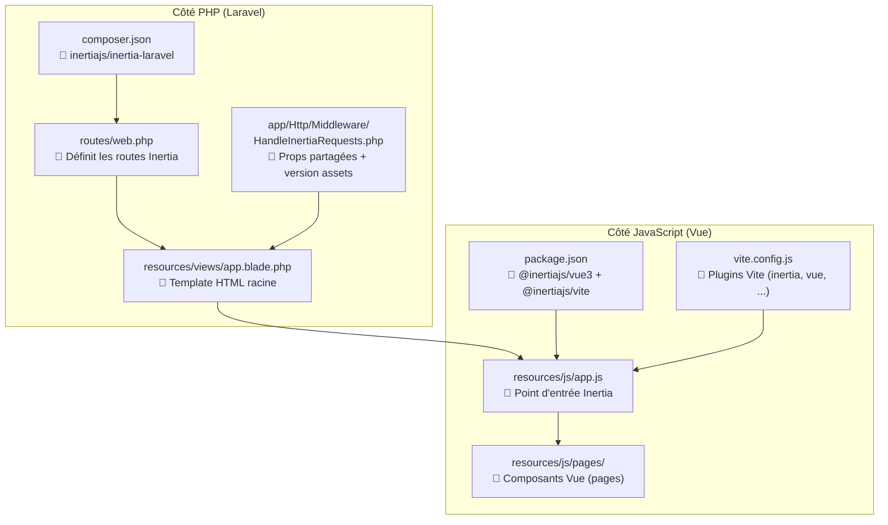
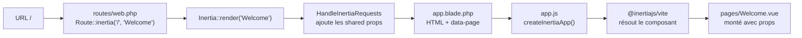

# 3. Installation et configuration dans ce projet

Ce chapitre fait le tour des fichiers qui constituent l'installation Inertia de ce projet. C'est une référence pour comprendre **où chaque morceau vit**.

## 3.1 Schéma des fichiers clés



## 3.2 Côté serveur

### 3.2.1 Package Composer

Le paquet est déclaré dans `composer.json` :

```
"inertiajs/inertia-laravel": "v3"
```

Il fournit :
- La façade `Inertia` (`Inertia::render(...)`)
- Le middleware de base `Inertia\Middleware`
- La macro `Route::inertia(...)`
- Les directives Blade `<x-inertia::head>` et `<x-inertia::app>`

### 3.2.2 Middleware `HandleInertiaRequests`

Fichier : `app/Http/Middleware/HandleInertiaRequests.php`

```php
<?php

namespace App\Http\Middleware;

use Illuminate\Http\Request;
use Inertia\Middleware;

class HandleInertiaRequests extends Middleware
{
    protected $rootView = 'app';

    public function version(Request $request): ?string
    {
        return parent::version($request);
    }

    public function share(Request $request): array
    {
        return [
            ...parent::share($request),
            'name' => config('app.name'),
        ];
    }
}
```

Ce qu'il fait :

| Méthode | Rôle |
|---|---|
| `$rootView = 'app'` | Indique que le template HTML racine est `resources/views/app.blade.php` |
| `version()` | Renvoie un hash basé sur les assets compilés. Inertia compare cette valeur au header `X-Inertia-Version` pour forcer un rechargement si nécessaire. |
| `share()` | Renvoie un tableau de **props partagées** disponibles sur **toutes les pages** (voir chapitre 8) |

Ce middleware est enregistré dans `bootstrap/app.php` (config Laravel 13).

### 3.2.3 Template Blade racine

Fichier : `resources/views/app.blade.php`

```blade
<!DOCTYPE html>
<html lang="{{ str_replace('_', '-', app()->getLocale()) }}"
      @class(['dark' => ($appearance ?? 'system') == 'dark'])>
    <head>
        <meta charset="utf-8">
        <meta name="viewport" content="width=device-width, initial-scale=1">

        @fonts

        @vite(['resources/css/app.css', 'resources/js/app.js',
               "resources/js/pages/{$page['component']}.vue"])
        <x-inertia::head>
            <title>{{ config('app.name', 'Laravel') }}</title>
        </x-inertia::head>
    </head>
    <body class="font-sans antialiased">
        <x-inertia::app />
    </body>
</html>
```

Points importants :

- **`<x-inertia::app />`** : génère `<div id="app" data-page='{...}'>` avec la payload Inertia.
- **`<x-inertia::head>`** : injecte les `<title>`, `<meta>` définis depuis `<Head>` dans les composants Vue.
- **`@vite([... "resources/js/pages/{$page['component']}.vue"])`** : lors du premier chargement, Vite précharge **uniquement** le composant nécessaire (code-splitting automatique).

## 3.3 Côté client

### 3.3.1 Paquets npm

Dans `package.json` :

```json
"@inertiajs/vue3": "^3.0.0",
"@inertiajs/vite": "^3.0.0",
"vue": "^3.5.13"
```

- **`@inertiajs/vue3`** : adaptateur Vue d'Inertia (composants `<Link>`, `<Head>`, `<Form>`, hook `useForm`, `router`, etc.)
- **`@inertiajs/vite`** : plugin Vite qui automatise le SSR et la résolution des pages.

### 3.3.2 Point d'entrée `app.js`

Fichier : `resources/js/app.js`

```js
import { createInertiaApp } from '@inertiajs/vue3';

const appName = import.meta.env.VITE_APP_NAME || 'Laravel';

createInertiaApp({
    title: (title) => (title ? `${title} - ${appName}` : appName),
    progress: {
        color: '#4B5563',
    },
});
```

`createInertiaApp()` fait **trois choses** :

1. **Résout le composant Vue** demandé par le serveur (ici via `@inertiajs/vite`, qui injecte la fonction `resolve` automatiquement).
2. **Crée l'application Vue** et la monte sur `<div id="app">`.
3. **Configure** : titre des pages, barre de progression, etc.

> Sans le plugin `@inertiajs/vite`, vous devriez écrire manuellement :
> ```js
> resolve: (name) => resolvePageComponent(`./pages/${name}.vue`,
>                       import.meta.glob('./pages/**/*.vue')),
> setup: ({ el, App, props, plugin }) => createApp({ render: () => h(App, props) })
>                       .use(plugin).mount(el),
> ```
> Le plugin Vite le fait pour vous.

### 3.3.3 Configuration Vite

Fichier : `vite.config.js`

```js
import inertia from '@inertiajs/vite';
import { wayfinder } from '@laravel/vite-plugin-wayfinder';
import tailwindcss from '@tailwindcss/vite';
import vue from '@vitejs/plugin-vue';
import laravel from 'laravel-vite-plugin';

export default defineConfig({
    plugins: [
        laravel({ input: ['resources/css/app.css', 'resources/js/app.js'], refresh: true, /* ... */ }),
        inertia(),
        tailwindcss(),
        vue({ template: { transformAssetUrls: { base: null, includeAbsolute: false } } }),
        wayfinder({ formVariants: true }),
    ],
});
```

| Plugin | Rôle |
|---|---|
| `laravel(...)` | Recharge automatique lors des changements de fichiers PHP |
| `inertia()` | Détection automatique des pages dans `resources/js/pages/`, support SSR transparent |
| `tailwindcss()` | Tailwind v4 |
| `vue(...)` | Compilation des SFC `.vue` |
| `wayfinder(...)` | Génère les fonctions JS typées pour appeler les routes Laravel |

### 3.3.4 Dossier des pages

Fichier : `resources/js/pages/Welcome.vue`

```vue
<script setup>
import { Head } from '@inertiajs/vue3';
</script>

<template>
    <Head title="Welcome" />
    <div class="flex min-h-screen items-center justify-center">
        <h1 class="text-2xl font-medium">Hello world</h1>
    </div>
</template>
```

**Convention importante :** quand Laravel renvoie `Inertia::render('Welcome')`, c'est le fichier `resources/js/pages/Welcome.vue` qui est rendu. Pour `Inertia::render('Users/Index')`, ce serait `resources/js/pages/Users/Index.vue`.

## 3.4 Commandes utiles

Quand vous travaillez sur l'app :

```bash
# Serveur Laravel + Vite + workers en parallèle
composer run dev

# Vite uniquement (rebuild en direct des assets)
npm run dev

# Build de production
npm run build

# Build SSR (génère aussi un bundle pour Node.js)
npm run build:ssr
```

## 3.5 Récapitulatif

Voici comment les fichiers s'imbriquent lors d'une visite :



## Étape suivante

➡️ [04-cote-serveur.md](04-cote-serveur.md) — Comment écrire des routes et contrôleurs Inertia côté Laravel.
