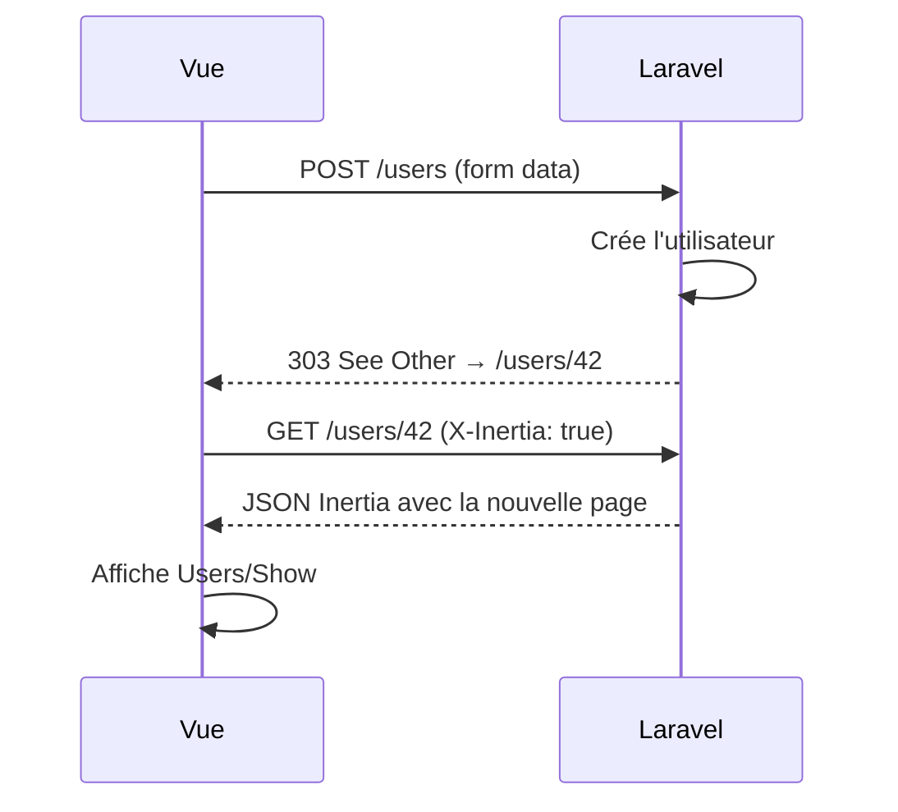

# 4. Côté serveur (Laravel)

Côté Laravel, écrire du code Inertia ressemble énormément à écrire du Laravel classique. La seule différence : au lieu de retourner une vue Blade, on retourne une **réponse Inertia**.

## 4.1 Définir une route Inertia

### Route directe (sans contrôleur)

Pour une page simple sans logique :

```php
// routes/web.php
use Illuminate\Support\Facades\Route;

Route::inertia('/', 'Welcome')->name('home');
```

Équivalent à :

```php
Route::get('/', fn () => Inertia::render('Welcome'))->name('home');
```

Vous pouvez aussi passer des props :

```php
Route::inertia('/about', 'About', [
    'version' => '1.0.0',
    'team' => ['Alice', 'Bob'],
])->name('about');
```

### Route avec contrôleur

Pour les pages avec logique (BD, autorisation, etc.) :

```php
// routes/web.php
Route::get('/users', [UserController::class, 'index'])->name('users.index');
Route::get('/users/{user}', [UserController::class, 'show'])->name('users.show');
```

```php
// app/Http/Controllers/UserController.php
namespace App\Http\Controllers;

use App\Models\User;
use Inertia\Inertia;
use Inertia\Response;

class UserController extends Controller
{
    public function index(): Response
    {
        return Inertia::render('Users/Index', [
            'users' => User::query()
                ->select('id', 'name', 'email')
                ->get(),
        ]);
    }

    public function show(User $user): Response
    {
        return Inertia::render('Users/Show', [
            'user' => $user,
        ]);
    }
}
```

## 4.2 La méthode `Inertia::render()`

C'est **la seule méthode** que vous utiliserez 90 % du temps.

```php
Inertia::render(string $component, array|Arrayable $props = []): Response
```

| Argument | Rôle |
|---|---|
| `$component` | Nom du fichier Vue dans `resources/js/pages/`, sans `.vue`. Utilise `/` pour les sous-dossiers. |
| `$props` | Tableau associatif passé en props au composant Vue. |

### Conventions de nommage

| `Inertia::render(...)` | Fichier Vue résolu |
|---|---|
| `'Welcome'` | `resources/js/pages/Welcome.vue` |
| `'Users/Index'` | `resources/js/pages/Users/Index.vue` |
| `'Settings/Profile/Edit'` | `resources/js/pages/Settings/Profile/Edit.vue` |

## 4.3 Sérialisation des props

Les props sont automatiquement sérialisées en JSON. Vous pouvez passer :

- Des scalaires (`string`, `int`, `bool`, `null`)
- Des tableaux
- Des objets `Arrayable` ou `JsonSerializable`
- Des modèles Eloquent (qui sont `Arrayable`)
- Des collections Eloquent
- Des **API Resources** (recommandé pour le contrôle)

### Avec une API Resource

```php
public function show(User $user): Response
{
    return Inertia::render('Users/Show', [
        'user' => UserResource::make($user),
    ]);
}
```

```php
// app/Http/Resources/UserResource.php
class UserResource extends JsonResource
{
    public function toArray($request): array
    {
        return [
            'id' => $this->id,
            'name' => $this->name,
            'email' => $this->email,
            'created_at' => $this->created_at?->toIso8601String(),
        ];
    }
}
```

> ⚠️ **Attention** : ne renvoyez **jamais** un modèle Eloquent brut contenant des champs sensibles (`password`, `remember_token`). Préférez les API Resources ou utilisez `$hidden` sur le modèle.

## 4.4 Redirections

Après un POST/PUT/DELETE, on redirige toujours (pattern PRG — Post/Redirect/Get) :

```php
public function store(StoreUserRequest $request): RedirectResponse
{
    $user = User::create($request->validated());

    return redirect()
        ->route('users.show', $user)
        ->with('success', 'Utilisateur créé');
}
```

Inertia détecte la redirection HTTP **303 See Other** et fait automatiquement une visite GET vers la nouvelle URL. Du côté Vue, c'est transparent.



## 4.5 Validation

La validation Laravel fonctionne **sans modification**. Les erreurs sont automatiquement renvoyées au formulaire Vue dans `props.errors`.

```php
public function store(Request $request): RedirectResponse
{
    $request->validate([
        'name' => 'required|string|max:255',
        'email' => 'required|email|unique:users',
    ]);

    User::create($request->all());

    return redirect()->route('users.index');
}
```

Ou avec un FormRequest :

```php
public function store(StoreUserRequest $request): RedirectResponse
{
    User::create($request->validated());
    return redirect()->route('users.index');
}
```

```php
class StoreUserRequest extends FormRequest
{
    public function rules(): array
    {
        return [
            'name' => ['required', 'string', 'max:255'],
            'email' => ['required', 'email', 'unique:users'],
        ];
    }
}
```

En cas d'erreur, Laravel renvoie un 303 vers la page précédente. Inertia recharge la page précédente, mais cette fois `props.errors` contient les erreurs. Voir [chapitre 7](07-formulaires.md).

## 4.6 Réponses externes (téléchargements, redirections externes)

### Téléchargement de fichier

```php
public function export(): BinaryFileResponse
{
    return response()->download(storage_path('app/users.csv'));
}
```

Pas besoin d'Inertia ici. Le composant `<Form>` côté client gère bien les téléchargements.

### Redirection vers un site externe

```php
public function logout()
{
    auth()->logout();
    return Inertia::location('https://external-sso.com/logout');
}
```

`Inertia::location()` force le navigateur à faire un **vrai redirect** (pas une visite Inertia).

## 4.7 Code de statut HTTP

Vous pouvez personnaliser le code de statut :

```php
return Inertia::render('Errors/NotFound')
    ->toResponse($request)
    ->setStatusCode(404);
```

Mais pour les erreurs, Inertia v3 propose un mécanisme dédié — voir le chapitre 11 (FAQ).

## 4.8 Wayfinder : routes typées dans Vue

Ce projet utilise **Wayfinder** : à chaque fois que vous créez ou modifiez une route, des fonctions JS sont auto-générées dans `resources/js/routes/` et `resources/js/actions/`.

```php
// routes/web.php
Route::get('/users/{user}', [UserController::class, 'show'])->name('users.show');
```

```vue
<!-- Côté Vue -->
<script setup>
import { show } from '@/routes/users';
</script>

<template>
    <Link :href="show(user.id)">Voir</Link>
</template>
```

Voir le chapitre 6 et la skill `wayfinder-development` pour les détails.

## 4.9 Récapitulatif

| Action | Code Laravel |
|---|---|
| Page simple sans logique | `Route::inertia('/', 'Welcome')` |
| Page avec contrôleur | `return Inertia::render('Users/Index', ['users' => ...])` |
| Après un POST réussi | `return redirect()->route('users.show', $user)` |
| Validation | `$request->validate([...])` (les erreurs vont dans `props.errors`) |
| Redirection externe | `return Inertia::location($url)` |

## Étape suivante

➡️ [05-cote-client.md](05-cote-client.md) — Comment écrire les pages Vue.
