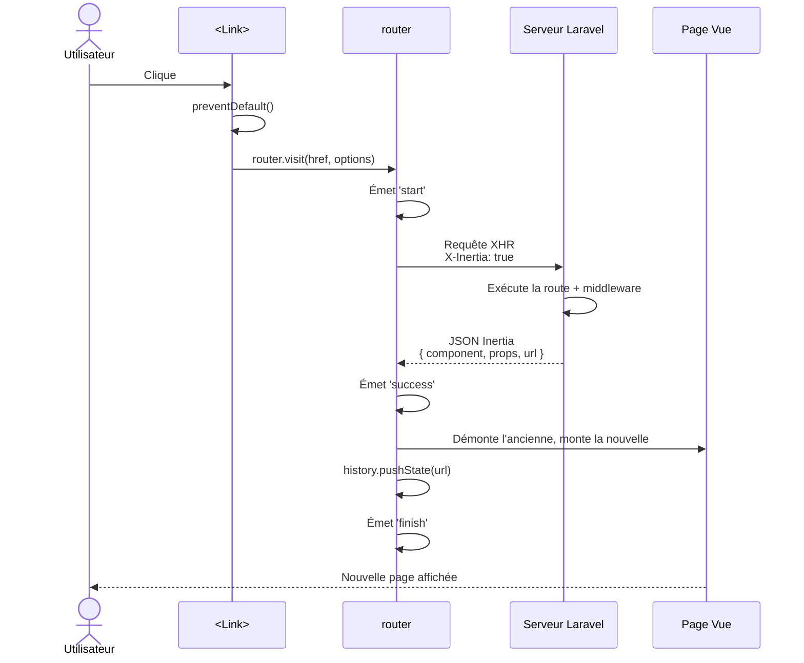

# 6. Navigation

Tout l'intérêt d'Inertia, c'est de **naviguer sans recharger la page**. Ce chapitre détaille les outils à votre disposition.

## 6.1 Le composant `<Link>`

C'est l'équivalent Inertia de la balise `<a>`. Visuellement c'est `<a href="...">`, mais le clic est intercepté pour faire une visite Inertia (pas un rechargement complet).

```vue
<script setup>
import { Link } from '@inertiajs/vue3';
</script>

<template>
    <Link href="/dashboard">Tableau de bord</Link>
    <Link href="/users/42">Profil</Link>
</template>
```

### Avec Wayfinder (recommandé dans ce projet)

Au lieu d'écrire `href="/users/42"` en dur, on utilise les fonctions générées par Wayfinder :

```vue
<script setup>
import { Link } from '@inertiajs/vue3';
import { show } from '@/routes/users';
</script>

<template>
    <Link :href="show(42)">Profil</Link>
    <!-- ou avec un objet user -->
    <Link :href="show(user.id)">{{ user.name }}</Link>
</template>
```

✅ Refactor-safe : si vous renommez la route, la fonction est régénérée automatiquement.

### Méthodes HTTP

Par défaut, `<Link>` fait un GET. Pour autre chose :

```vue
<Link href="/logout" method="post" as="button">Se déconnecter</Link>
<Link href="/users/42" method="delete" as="button">Supprimer</Link>
```

> ⚠️ **Important** : avec `method="post"`, `put`, `patch`, `delete`, ajoutez `as="button"`. Sinon le HTML reste un `<a>`, ce qui est invalide sémantiquement et casse certains comportements (clic droit "Ouvrir dans un nouvel onglet" ferait un GET).

### Avec des données

```vue
<Link href="/users" method="post" :data="{ name: 'Alice' }" as="button">
    Créer un utilisateur
</Link>
```

Mais pour les formulaires, préférez le composant `<Form>` (voir chapitre 7).

## 6.2 Props utiles de `<Link>`

| Prop | Description |
|---|---|
| `href` | URL de destination |
| `method` | `get` (défaut), `post`, `put`, `patch`, `delete` |
| `data` | Objet de données à envoyer |
| `as` | Élément HTML à utiliser (`a` par défaut, mettre `button` si method ≠ get) |
| `replace` | Remplacer l'entrée d'historique au lieu d'en pousser une nouvelle |
| `preserve-state` | Garder l'état Vue local (`data()`, refs) après la visite |
| `preserve-scroll` | Ne pas remettre le scroll en haut de page |
| `only` | Recharger uniquement certaines props (voir [chapitre 8](08-props-partagees.md)) |
| `prefetch` | Précharger la page (voir chapitre 9) |
| `cache-for` | Mettre en cache la page (utilisé avec prefetch) |

### Exemple complet

```vue
<Link
    :href="dashboard()"
    preserve-scroll
    preserve-state
    prefetch
    :only="['notifications']"
>
    Rafraîchir les notifs
</Link>
```

## 6.3 Navigation programmatique : `router`

Pour naviguer depuis du JavaScript (après un évènement, dans un `watch`, etc.) :

```vue
<script setup>
import { router } from '@inertiajs/vue3';

function goToDashboard() {
    router.visit('/dashboard');
}

function deleteUser(id) {
    if (confirm('Sûr ?')) {
        router.delete(`/users/${id}`);
    }
}
</script>
```

### Méthodes du `router`

```js
// Visite GET
router.visit(url, options);
router.get(url, data, options);

// POST / PUT / PATCH / DELETE
router.post(url, data, options);
router.put(url, data, options);
router.patch(url, data, options);
router.delete(url, options);

// Recharger la page actuelle
router.reload({ only: ['notifications'] });

// Visiter sans pousser dans l'historique
router.visit(url, { replace: true });

// Annuler les requêtes Inertia en cours (v3)
router.cancelAll();
```

### Options communes

```js
router.post('/users', formData, {
    preserveScroll: true,
    preserveState: true,
    onBefore: () => console.log('avant'),
    onStart: () => console.log('requête démarrée'),
    onProgress: (e) => console.log(`Upload: ${e.percentage}%`),
    onSuccess: (page) => console.log('OK', page),
    onError: (errors) => console.log('Erreurs', errors),
    onFinish: () => console.log('terminé (succès ou erreur)'),
});
```

## 6.4 Évènements globaux

Vous pouvez écouter les évènements de navigation Inertia :

```js
import { router } from '@inertiajs/vue3';

router.on('start', (event) => {
    console.log('Démarrage de la visite vers', event.detail.visit.url);
});

router.on('success', (event) => {
    console.log('Succès', event.detail.page);
});

router.on('finish', () => console.log('Fini'));

// v3 : renommages
router.on('httpException', (event) => { /* anciennement 'invalid' */ });
router.on('networkError', (event) => { /* anciennement 'exception' */ });
```

Utile pour, par exemple, fermer un menu mobile à chaque navigation.

## 6.5 Préserver l'état et le scroll

### Par défaut, à chaque navigation :
- Vue démonte la page → toute la **state locale** est perdue
- Le navigateur reset le **scroll** en haut

### Avec `preserve-state` :

```vue
<Link :href="page2()" preserve-state>Page 2</Link>
```

Si la nouvelle page est **le même composant** que l'actuelle, l'état Vue local (refs, `ref()`, `reactive()`) est préservé.

> Cas typique : un formulaire de recherche. L'utilisateur tape `?q=foo`, la liste se met à jour, mais le champ de recherche garde le focus et la valeur.

### Avec `preserve-scroll` :

```vue
<Link :href="page2()" preserve-scroll>Page 2</Link>
```

Le scroll reste où il est.

## 6.6 Visites partielles (`only`)

Si vous ne voulez recharger **qu'une partie** des props :

```vue
<Link :href="dashboard()" :only="['notifications']">
    Rafraîchir
</Link>
```

Côté Laravel, **seules** les props demandées seront recalculées et renvoyées. C'est une optimisation puissante (voir [chapitre 8](08-props-partagees.md)).

## 6.7 Diagramme : flux d'un clic sur `<Link>`



## 6.8 Récapitulatif

| Cas d'usage | Outil |
|---|---|
| Lien standard | `<Link href="...">` |
| Lien avec route nommée | `<Link :href="show(id)">` (avec Wayfinder) |
| Bouton supprimer | `<Link method="delete" as="button">` |
| Navigation après action JS | `router.visit(...)` ou `router.post(...)` |
| Recharger uniquement 1 prop | `router.reload({ only: ['xxx'] })` |
| Préserver le scroll | `preserve-scroll` |
| Préserver l'état Vue | `preserve-state` |

## Étape suivante

➡️ [07-formulaires.md](07-formulaires.md) — Soumettre des formulaires avec Inertia.
