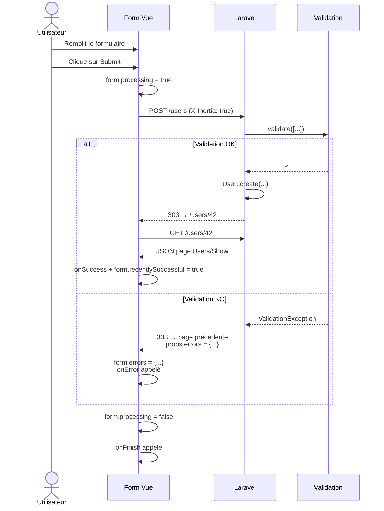

# 7. Formulaires

Les formulaires sont **le point fort** d'Inertia. Tout y est pensé : validation, erreurs, état de soumission, fichiers, etc.

Vous avez deux options : le hook `useForm` ou le composant `<Form>` (v3).

## 7.1 Le hook `useForm`

C'est la manière la plus courante d'écrire un formulaire.

```vue
<script setup>
import { useForm } from '@inertiajs/vue3';

const form = useForm({
    name: '',
    email: '',
    password: '',
});

function submit() {
    form.post('/register');
}
</script>

<template>
    <form @submit.prevent="submit">
        <div>
            <label>Nom</label>
            <input v-model="form.name" />
            <p v-if="form.errors.name" class="text-red-500">
                {{ form.errors.name }}
            </p>
        </div>

        <div>
            <label>Email</label>
            <input v-model="form.email" type="email" />
            <p v-if="form.errors.email" class="text-red-500">
                {{ form.errors.email }}
            </p>
        </div>

        <div>
            <label>Mot de passe</label>
            <input v-model="form.password" type="password" />
            <p v-if="form.errors.password" class="text-red-500">
                {{ form.errors.password }}
            </p>
        </div>

        <button type="submit" :disabled="form.processing">
            <span v-if="form.processing">Enregistrement…</span>
            <span v-else>S'inscrire</span>
        </button>
    </form>
</template>
```

### Ce que `useForm` vous donne gratuitement

| Propriété | Rôle |
|---|---|
| `form.<champ>` | Modèle réactif pour `v-model` |
| `form.errors.<champ>` | Erreur de validation pour ce champ (string ou undefined) |
| `form.hasErrors` | `true` si au moins un champ a une erreur |
| `form.processing` | `true` pendant que la requête est en cours |
| `form.progress` | Objet `{ percentage, ... }` (utile pour les uploads) |
| `form.wasSuccessful` | `true` si la dernière soumission a réussi |
| `form.recentlySuccessful` | `true` pendant 2s après une soumission réussie (utile pour afficher un "✓ Enregistré") |
| `form.isDirty` | `true` si les valeurs ont changé par rapport à l'init |

### Méthodes de soumission

```js
form.get('/users');
form.post('/users');
form.put('/users/42');
form.patch('/users/42');
form.delete('/users/42');
form.submit('post', '/users');
```

### Options de soumission

```js
form.post('/users', {
    preserveScroll: true,
    onSuccess: () => form.reset(),
    onError: (errors) => alert('Erreurs : ' + Object.keys(errors).join(', ')),
    onFinish: () => console.log('Terminé'),
});
```

### Méthodes utilitaires

```js
form.reset();              // Remet toutes les valeurs à leur état initial
form.reset('name');        // Remet uniquement 'name'
form.clearErrors();        // Vide toutes les erreurs
form.clearErrors('email'); // Vide l'erreur d'un champ
form.setError('email', 'Email invalide');
form.cancel();             // Annule la requête en cours
form.transform((data) => ({ ...data, foo: 'bar' })); // Modifie les données avant envoi
```

## 7.2 Cycle de vie d'un formulaire



## 7.3 Upload de fichiers

Inertia détecte automatiquement les `File`/`Blob` dans le formulaire et envoie en `multipart/form-data` :

```vue
<script setup>
import { useForm } from '@inertiajs/vue3';

const form = useForm({
    name: '',
    avatar: null,
});

function onFile(e) {
    form.avatar = e.target.files[0];
}
</script>

<template>
    <form @submit.prevent="form.post('/profile')">
        <input v-model="form.name" />
        <input type="file" @change="onFile" />

        <div v-if="form.progress">
            Upload : {{ form.progress.percentage }}%
        </div>

        <button :disabled="form.processing">Envoyer</button>
    </form>
</template>
```

> 🚨 **Limite Laravel** : PHP ne supporte pas nativement `PUT`/`PATCH`/`DELETE` avec `multipart/form-data`. Inertia ajoute automatiquement `_method=PUT` pour contourner ça — la route Laravel doit être déclarée en POST mais peut être réécrite via `Route::put(...)` (Laravel gère le method-spoofing pour vous).

## 7.4 Le composant `<Form>` (v3)

Inertia v3 propose un composant `<Form>` plus déclaratif qui gère le `FormData` lui-même.

```vue
<script setup>
import { Form } from '@inertiajs/vue3';
import { store } from '@/actions/UserController';
</script>

<template>
    <Form :action="store()" v-slot="{ errors, processing, recentlySuccessful }">
        <input name="name" />
        <p v-if="errors.name">{{ errors.name }}</p>

        <input name="email" type="email" />
        <p v-if="errors.email">{{ errors.email }}</p>

        <button :disabled="processing">Enregistrer</button>
        <span v-if="recentlySuccessful">✓ Enregistré</span>
    </Form>
</template>
```

Avec Wayfinder + `formVariants: true` (configuré dans ce projet), on peut directement :

```vue
<script setup>
import { Form } from '@inertiajs/vue3';
import UserController from '@/actions/UserController';
</script>

<template>
    <Form v-bind="UserController.store.form()" v-slot="{ errors, processing }">
        <!-- ... -->
    </Form>
</template>
```

Le slot reçoit toutes les propriétés du form :
- `errors` (équivalent de `form.errors`)
- `processing`
- `progress`
- `wasSuccessful`
- `recentlySuccessful`
- `submit()` pour soumettre manuellement
- `reset()`, `clearErrors()`, etc.

## 7.5 Validation côté Laravel

Aucune différence avec un projet Laravel classique. Voir [chapitre 4](04-cote-serveur.md).

```php
public function store(Request $request)
{
    $request->validate([
        'name' => 'required|max:255',
        'email' => 'required|email|unique:users',
    ]);

    User::create($request->all());
    return redirect()->route('users.index');
}
```

En cas d'échec :
- Laravel lance une `ValidationException` (gérée par le handler par défaut)
- Réponse : `303 See Other` vers la page précédente
- Les erreurs sont stockées dans la session, et automatiquement injectées dans `props.errors` par le middleware Inertia
- Vue voit `form.errors.name = "Le champ name est obligatoire"`

## 7.6 Pattern : afficher un toast de succès

```vue
<script setup>
import { useForm, usePage } from '@inertiajs/vue3';
import { watch } from 'vue';
import { toast } from 'vue-sonner';

const form = useForm({ name: '' });
const page = usePage();

watch(() => page.props.flash?.success, (msg) => {
    if (msg) toast.success(msg);
});

function submit() {
    form.post('/users');
}
</script>
```

Côté Laravel :

```php
return redirect()->route('users.index')
    ->with('success', 'Utilisateur créé !');
```

Et dans `HandleInertiaRequests::share()` :

```php
return [
    ...parent::share($request),
    'flash' => [
        'success' => fn () => $request->session()->get('success'),
        'error' => fn () => $request->session()->get('error'),
    ],
];
```

## 7.7 Sauvegarder un brouillon (LocalStorage)

`useForm` peut **persister** son état :

```js
const form = useForm('UniqueKey', {
    title: '',
    content: '',
});
```

Le premier argument est une clé. À chaque modification, le formulaire est sauvegardé dans `localStorage`. Pratique pour un brouillon d'article.

Pour effacer la sauvegarde :

```js
form.reset();
form.defaults();  // ou
```

## 7.8 Récapitulatif

| Cas | Outil |
|---|---|
| Formulaire simple | `useForm({...})` + `form.post(...)` |
| Formulaire déclaratif | `<Form :action="...">` |
| Upload de fichier | Mettre l'objet `File` dans le form, Inertia gère `multipart` |
| Afficher les erreurs | `form.errors.<champ>` |
| Désactiver pendant l'envoi | `:disabled="form.processing"` |
| Toast de succès | `flash` partagé + `vue-sonner` |
| Brouillon localStorage | `useForm('cle', {...})` |

## Étape suivante

➡️ [08-props-partagees.md](08-props-partagees.md) — Données partagées entre toutes les pages.
