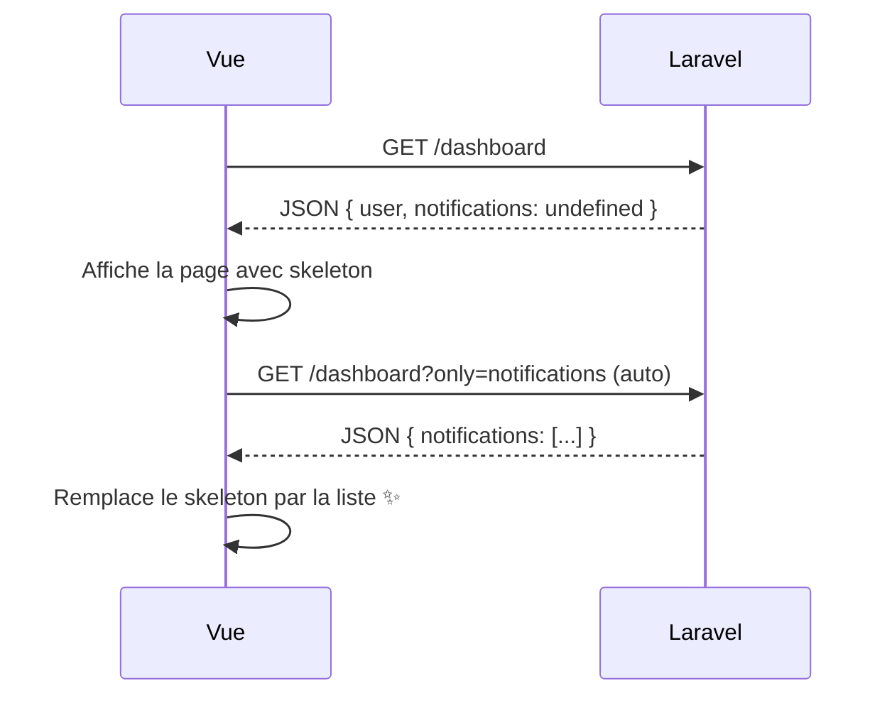
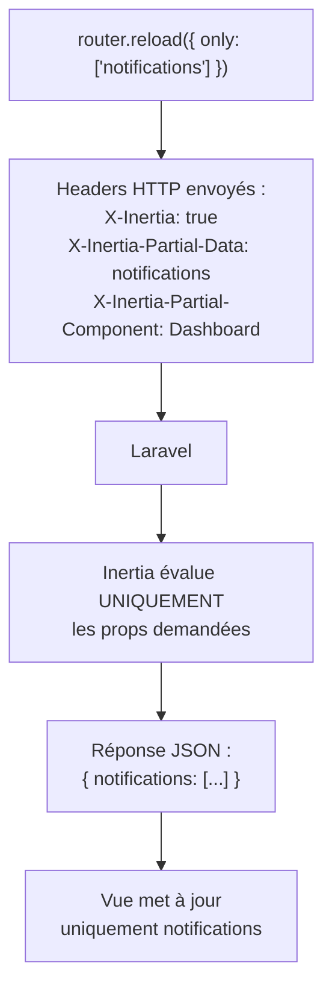

# 8. Props partagées (Shared Data)

Les **shared data** sont des props disponibles sur **toutes les pages**, sans avoir à les passer à chaque `Inertia::render()`. Typiquement : l'utilisateur connecté, les notifications, les messages flash, etc.

## 8.1 Où définir les shared data

Dans le middleware `HandleInertiaRequests` du projet :

```php
// app/Http/Middleware/HandleInertiaRequests.php
public function share(Request $request): array
{
    return [
        ...parent::share($request),
        'name' => config('app.name'),
    ];
}
```

Tout ce qui est dans le tableau retourné par `share()` est **automatiquement** ajouté aux props de chaque page.

## 8.2 Exemple complet : utilisateur connecté + flash

```php
public function share(Request $request): array
{
    return [
        ...parent::share($request),

        'name' => config('app.name'),

        // Utilisateur connecté
        'auth' => [
            'user' => $request->user() ? [
                'id' => $request->user()->id,
                'name' => $request->user()->name,
                'email' => $request->user()->email,
            ] : null,
        ],

        // Messages flash
        'flash' => [
            'success' => fn () => $request->session()->get('success'),
            'error' => fn () => $request->session()->get('error'),
        ],

        // Errors (déjà ajouté par parent::share)
    ];
}
```

> 💡 **Important** : utilisez des **closures** (`fn () => ...`) pour les valeurs coûteuses à calculer. Inertia ne les évaluera **que si la prop est effectivement demandée** par la page (utile avec les visites partielles).

## 8.3 Accéder aux shared data dans Vue

Via `usePage()` :

```vue
<script setup>
import { usePage } from '@inertiajs/vue3';
import { computed } from 'vue';

const page = usePage();
const user = computed(() => page.props.auth?.user);
const appName = computed(() => page.props.name);
</script>

<template>
    <header>
        {{ appName }}
        <span v-if="user">Bonjour {{ user.name }}</span>
    </header>
</template>
```

`page.props` contient :
- Toutes les **shared data** définies par `share()`
- Les **props de la page** définies par `Inertia::render('...', [...])`
- Les **erreurs de validation** dans `page.props.errors`

> ⚠️ **Réactivité** : `page.props` est réactif. Utilisez `computed()` pour réagir aux changements de manière propre, plutôt que d'extraire les valeurs en variables locales.

## 8.4 Types de props avancés

### 8.4.1 `Inertia::optional()` — chargement à la demande

Si une prop est **coûteuse** à calculer et n'est pas nécessaire à chaque visite :

```php
return Inertia::render('Dashboard', [
    'users' => fn () => User::all(),  // toujours chargée
    'stats' => Inertia::optional(fn () => Stat::heavyComputation()),
]);
```

`Inertia::optional(...)` ne sera évaluée **que** si la page la demande explicitement via une visite partielle :

```vue
<Link :href="dashboard()" :only="['stats']">Charger les stats</Link>
```

ou

```js
router.reload({ only: ['stats'] });
```

> ⚠️ Inertia v3 a **remplacé `Inertia::lazy()`** par `Inertia::optional()`. Si vous voyez `lazy()` dans la doc, c'est l'ancien nom.

### 8.4.2 `Inertia::defer()` — différer après le rendu initial

La prop est envoyée vide au premier rendu, puis chargée automatiquement après que la page est affichée. Idéal pour les widgets secondaires :

```php
return Inertia::render('Dashboard', [
    'user' => $user, // critique, chargé tout de suite
    'notifications' => Inertia::defer(fn () => Notification::query()->latest()->get()),
]);
```

Côté Vue :

```vue
<script setup>
import { Deferred } from '@inertiajs/vue3';
defineProps({ notifications: Array });
</script>

<template>
    <Deferred data="notifications">
        <template #fallback>
            <div class="animate-pulse h-12 bg-gray-200 rounded"></div>
        </template>

        <ul>
            <li v-for="n in notifications" :key="n.id">{{ n.message }}</li>
        </ul>
    </Deferred>
</template>
```



### 8.4.3 `Inertia::merge()` — pagination infinie

Pour fusionner les nouvelles props avec les anciennes au lieu de les remplacer (ex. : scroll infini) :

```php
return Inertia::render('Posts/Index', [
    'posts' => Inertia::merge(fn () => Post::paginate(20)),
]);
```

À la visite suivante (`page=2`), les nouveaux posts sont **ajoutés** à la liste au lieu de la remplacer.

### 8.4.4 `Inertia::always()` — toujours présent

Force une prop à être renvoyée **même** lors d'une visite partielle :

```php
return Inertia::render('Dashboard', [
    'user' => Inertia::always($request->user()),
    'stats' => fn () => Stat::all(),
]);
```

### 8.4.5 Tableau récapitulatif

| Type | Comportement | Cas d'usage |
|---|---|---|
| Closure `fn () => ...` | Évaluée si présente dans la réponse | Données standards |
| `Inertia::optional(...)` | Non envoyée sauf si demandée explicitement | Données coûteuses et rares |
| `Inertia::defer(...)` | Envoyée vide, puis chargée après affichage | Widgets secondaires |
| `Inertia::merge(...)` | Fusionne avec les valeurs existantes | Scroll infini, append |
| `Inertia::always(...)` | Toujours renvoyée, même en visite partielle | Auth user, flash |

## 8.5 Visites partielles (`only` et `except`)

Une **visite partielle** demande au serveur de **ne pas tout renvoyer**. C'est la base de plusieurs optimisations.

```js
// Recharger seulement notifications + flash
router.reload({ only: ['notifications', 'flash'] });

// Recharger tout sauf les stats (coûteuses)
router.reload({ except: ['stats'] });
```

Côté Laravel, le middleware Inertia gère ça automatiquement : il regarde le header `X-Inertia-Partial-Data` et n'évalue que les closures correspondantes.



## 8.6 Path dot-notation (props imbriquées) — v3

Vous pouvez cibler des props **imbriquées** :

```php
return Inertia::render('Dashboard', [
    'data' => [
        'user' => $user,
        'stats' => Inertia::defer(fn () => Stat::all()),
        'notifs' => Inertia::optional(fn () => Notif::recent()),
    ],
]);
```

```js
router.reload({ only: ['data.stats'] });
```

## 8.7 Pièges courants

### ❌ Charger une donnée coûteuse à chaque page

```php
public function share(Request $request): array
{
    return [
        // ❌ Cette requête est exécutée à CHAQUE visite Inertia
        'menus' => Menu::with('items')->get(),
    ];
}
```

✅ Utilisez une closure ou un cache :

```php
'menus' => fn () => Cache::remember('menus', 3600, fn () => Menu::with('items')->get()),
```

### ❌ Exposer des données sensibles via `share()`

`share()` renvoie ses props à **toutes les pages**. Ne mettez **jamais** :
- Tokens d'API
- Clés secrètes
- Données privées d'autres utilisateurs

### ❌ Stocker des objets non-sérialisables

```php
'something' => new \Closure(...) // ❌ pas sérialisable
'something' => fn () => ['x' => 1] // ✅ closure renvoyant un tableau
```

## 8.8 Récapitulatif

- **Définir des shared data** : `HandleInertiaRequests::share()`
- **Accéder** : `usePage().props`
- **Différer le chargement** : `Inertia::defer()`
- **Charger à la demande** : `Inertia::optional()`
- **Fusionner (scroll infini)** : `Inertia::merge()`
- **Toujours présent** : `Inertia::always()`
- **Recharger une prop seule** : `router.reload({ only: ['x'] })`

## Étape suivante

➡️ [09-fonctionnalites-avancees.md](09-fonctionnalites-avancees.md) — Polling, prefetching, optimistic updates, etc.
