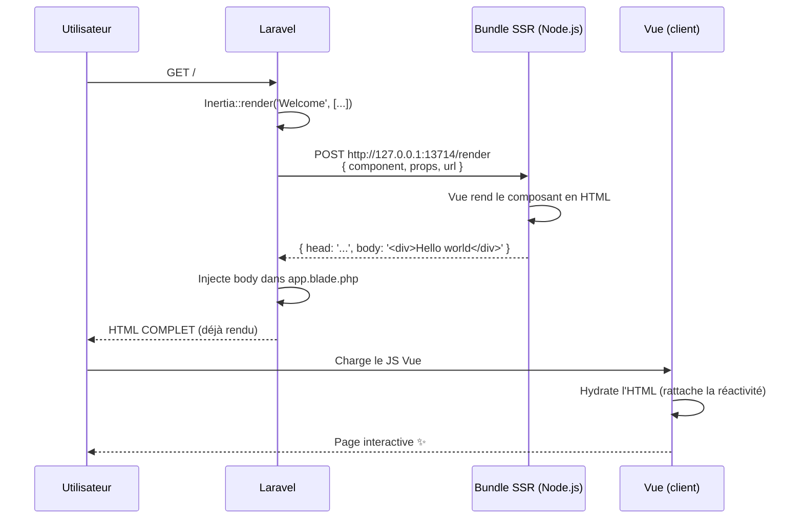

# 10. Server-Side Rendering (SSR)

Le **SSR** consiste à rendre la page côté serveur (en HTML) avant de l'envoyer au navigateur, plutôt que de laisser Vue le faire au chargement.

## 10.1 Pourquoi SSR ?

| Avantage | Détail |
|---|---|
| 🔍 **SEO** | Les bots (Google, Bing, réseaux sociaux) voient un HTML complet, pas une page vide |
| ⚡ **Performance perçue** | L'utilisateur voit du contenu **avant** que Vue ne se charge |
| 🔗 **Open Graph / cartes Twitter** | Les meta tags sont présents dès la première réponse |

## 10.2 Comment ça marche



L'utilisateur voit la page **immédiatement** (HTML), puis Vue prend le relais (hydration) pour la rendre interactive.

## 10.3 Configuration dans ce projet

### 10.3.1 Avec `@inertiajs/vite` (v3)

Le SSR est gravement simplifié grâce au plugin `@inertiajs/vite` (déjà présent dans `vite.config.js`).

**En développement** (`npm run dev`) : SSR fonctionne **automatiquement**, pas de serveur Node séparé à lancer.

**En production** :

```bash
# 1. Build du frontend + bundle SSR
npm run build:ssr
```

Cela génère :
- `public/build/` → assets client (CSS, JS)
- `bootstrap/ssr/ssr.js` → bundle SSR

Puis :

```bash
# 2. Démarrer le serveur SSR
php artisan inertia:start-ssr
```

Cela lance un processus Node.js sur le port 13714 (par défaut) qui rend les pages côté serveur.

> En général, ce processus tourne via **Supervisor** ou un orchestrateur (`systemd`, Forge, Laravel Cloud) en production.

### 10.3.2 Activer SSR dans le middleware

Dans `app/Http/Middleware/HandleInertiaRequests.php`, le SSR est activé par défaut. Pour le désactiver à la volée :

```php
// config/inertia.php
'ssr' => [
    'enabled' => env('INERTIA_SSR_ENABLED', true),
    'url' => env('INERTIA_SSR_URL', 'http://127.0.0.1:13714'),
],
```

Variables d'env :

```env
INERTIA_SSR_ENABLED=true
INERTIA_SSR_URL=http://127.0.0.1:13714
```

## 10.4 Précautions à prendre dans les pages

Quand SSR est activé, vos composants Vue sont exécutés **deux fois** :
1. Une fois côté **Node** (rendu HTML)
2. Une fois côté **navigateur** (hydration)

Cela signifie que certaines APIs **ne sont pas dispo côté Node** :
- `window`, `document`, `localStorage`
- `IntersectionObserver`
- `navigator`

### ❌ Mauvais : utiliser `window` au montage

```vue
<script setup>
const width = window.innerWidth; // ❌ Plante côté SSR (window n'existe pas)
</script>
```

### ✅ Bon : utiliser `onMounted` (jamais exécuté côté serveur)

```vue
<script setup>
import { onMounted, ref } from 'vue';

const width = ref(0);

onMounted(() => {
    width.value = window.innerWidth; // ✅ Sécurisé : onMounted = client uniquement
});
</script>
```

### Pattern courant : `import.meta.env.SSR`

```vue
<script setup>
if (import.meta.env.SSR) {
    // code SSR uniquement
} else {
    // code client uniquement
}
</script>
```

## 10.5 Données et SSR

Bonne nouvelle : **rien ne change** côté Laravel. Les props sont calculées normalement, Inertia les passe au bundle SSR. Pas de fetch supplémentaire à gérer.

## 10.6 Diagnostiquer un problème SSR

Si une page plante en SSR :

1. Vérifier les logs du processus SSR :
   ```bash
   php artisan inertia:start-ssr
   # ou les logs Supervisor en prod
   ```

2. Si SSR plante, **Inertia bascule automatiquement** sur le rendu client (`<div id="app"></div>` vide → Vue le remplit au chargement). Ça reste fonctionnel, mais sans bénéfice SEO.

3. Tester sans SSR :
   ```env
   INERTIA_SSR_ENABLED=false
   ```

## 10.7 SSR avec dev tools

En dev (`npm run dev`), grâce à `@inertiajs/vite`, le SSR fonctionne **sans processus Node séparé**. Vite gère le rendu serveur via son propre runtime.

Pour vérifier que le SSR fonctionne, faites un **clic droit → Afficher le source** dans le navigateur. Si vous voyez votre contenu (et pas juste `<div id="app"></div>`), SSR est actif.

## 10.8 Récapitulatif

- **Activer SSR en prod** : `npm run build:ssr` + `php artisan inertia:start-ssr`
- **En dev** : automatique via `@inertiajs/vite`
- **Précaution n°1** : éviter `window`/`document` en dehors de `onMounted`
- **Variables d'env** : `INERTIA_SSR_ENABLED`, `INERTIA_SSR_URL`
- **Fallback** : si SSR plante, rendu client en secours

## Étape suivante

➡️ [11-faq.md](11-faq.md) — Questions fréquentes et pièges courants.
